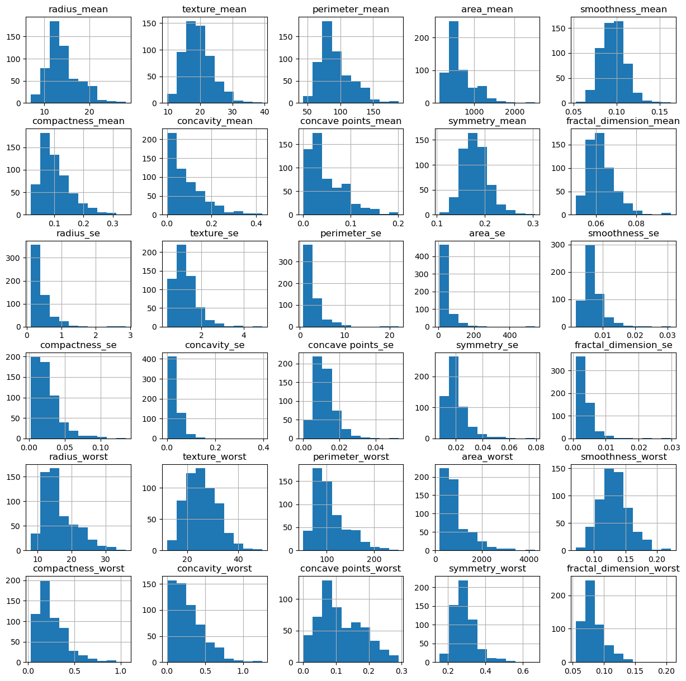
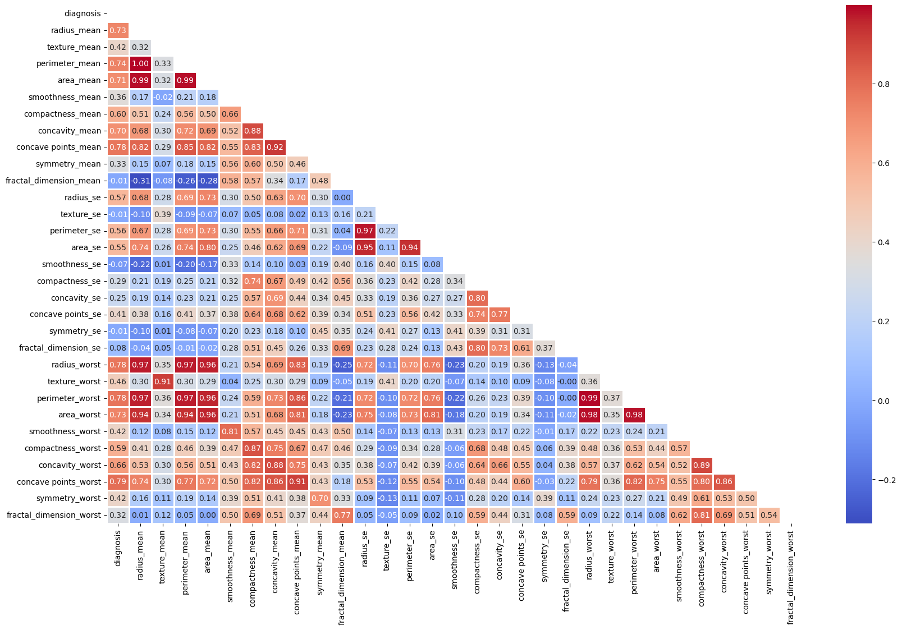

## **Relatório de Análise de Dados de Câncer de Mama**

**Autor** : Wellington Moreira - Cientista de Dados

**Contatos** : wsantos08@hotmail.com | [Linkedin](https://www.linkedin.com/in/wellington-moreira-santos)

---

### **Introdução**

#### **Descrição do Problema**
O câncer de mama é uma das doenças mais comuns que afetam as mulheres em todo o mundo. Diagnósticos precisos e precoces são fundamentais para o tratamento eficaz e a redução da mortalidade. Este conjunto de dados contém características computacionais de tumores de mama, derivadas de imagens digitalizadas de exames clínicos, onde cada tumor é classificado como benigno ou maligno.

#### **Objetivo da Análise**
O objetivo desta análise é explorar um conjunto de dados que contém informações sobre as características de tumores de mama. A análise visa identificar padrões e variáveis que estão associadas ao diagnóstico de malignidade e fornecer insights úteis para possíveis aplicações em modelos preditivos futuros.

### **Exploração dos Dados**

#### **Estrutura dos Dados**
O dataset contém informações sobre 569 pacientes com 31 variáveis numéricas descrevendo as características físicas dos tumores e uma variável categórica representando o diagnóstico (benigno ou maligno). A tabela a seguir resume a estrutura do dataset:

| Coluna                   | Descrição                                                  | Tipo de Dados |
|--------------------------|------------------------------------------------------------|---------------|
| `diagnosis`               | Diagnóstico do tumor (B = Benigno, M = Maligno)            | Categórico    |
| `radius_mean`             | Média das distâncias do centro aos pontos da periferia     | Numérico      |
| `texture_mean`            | Desvio padrão das intensidades dos pixels                  | Numérico      |
| `perimeter_mean`          | Perímetro do tumor                                         | Numérico      |
| `area_mean`               | Área do tumor                                              | Numérico      |
| `smoothness_mean`         | Variação local nos comprimentos do raio                    | Numérico      |
| `compactness_mean`        | Perímetro²/Área - 1                                        | Numérico      |
| `concavity_mean`          | Gravidade das porções côncavas do contorno                 | Numérico      |
| `concave points_mean`     | Número de porções côncavas do contorno                     | Numérico      |
| `symmetry_mean`           | Simetria do tumor                                          | Numérico      |
| `fractal_dimension_mean`  | Aproximação da linha de costa                              | Numérico      |

#### **Estatísticas Descritivas**
As estatísticas descritivas fornecem uma visão geral das variáveis numéricas no dataset:

- **Raio Médio:** Média de 14,1, com desvio padrão de 3,5.
- **Área Média:** Média de 654,8, com desvio padrão de 351,9.
- **Perímetro Médio:** Média de 91,9, com desvio padrão de 24,3.
- **Compactação Média:** Média de 0,10, com desvio padrão de 0,05.

#### **Análise de Valores Ausentes**
O dataset não contém valores ausentes, o que facilita a análise e garante a integridade dos resultados.

#### **Distribuição das Variáveis**
- **Diagnóstico:** A distribuição da variável alvo (`diagnosis`) mostra que há mais casos de tumores benignos (`0`) do que malignos (`1`).
  
  

- **Características Físicas do Tumor:** A maioria das variáveis numéricas apresenta distribuições assimétricas, com alguns outliers (como o perímetro e a área), o que sugere a possibilidade de tumores de grandes dimensões nos casos malignos.
  
  

### **Análise de Outliers**
Para identificar possíveis valores atípicos nas características dos tumores, foi realizada uma análise de outliers utilizando o intervalo interquartil (IQR). As variáveis com maior quantidade de outliers são:

- `area_worst`: 40 outliers
- `perimeter_worst`: 33 outliers
- `radius_worst`: 30 outliers

Esses outliers podem representar tumores de tamanhos extremos que podem ser de interesse particular em estudos médicos mais detalhados.

### **Análise de Correlação**

#### **Matriz de Correlação**
Foi calculada a matriz de correlação entre as variáveis para identificar quais características estão mais associadas ao diagnóstico de malignidade. As variáveis com maior correlação positiva com o diagnóstico maligno incluem:

- `concave points_worst`: 0.79
- `perimeter_worst`: 0.78
- `radius_worst`: 0.78
- `area_worst`: 0.73

Essas características indicam que tumores com maior perímetro, raio e concavidade têm uma maior probabilidade de serem malignos.

#### **Gráficos de Correlação**
O mapa de calor da matriz de correlação ajuda a visualizar rapidamente as relações entre as variáveis:

As correlações mais fortes são observadas entre as variáveis relacionadas às dimensões do tumor (raio, perímetro e área) e o diagnóstico maligno.

### **Tratamento dos Dados**

#### **Transformações Realizadas**
- **Remoção de Colunas Irrelevantes:** As colunas `id` e `Unnamed: 32` foram removidas, pois não adicionam valor para a análise.
- **Codificação do Diagnóstico:** A variável categórica `diagnosis` foi codificada em valores binários: `M = 1` (maligno) e `B = 0` (benigno), facilitando a análise de correlação e modelagem preditiva.

### **Conclusão**

#### **Resumo das Principais Descobertas**
- Tumores malignos tendem a ter características geométricas mais extremas, como maiores valores de raio, perímetro e área.
- As variáveis mais correlacionadas com o diagnóstico maligno são `concave points_worst`, `perimeter_worst` e `radius_worst`.
- A distribuição dos dados sugere a presença de outliers, especialmente em variáveis relacionadas ao tamanho do tumor, que podem representar casos extremos ou anomalias nos dados.

#### **Visão Estatística**
Os histogramas revelam padrões típicos de distribuição nas variáveis relacionadas aos tumores. Tumores malignos tendem a apresentar maiores variações nas dimensões (como área e perímetro), refletindo em maiores correlações com o diagnóstico.

Esse conjunto de dados, após a análise exploratória, está pronto para ser utilizado em tarefas de modelagem preditiva, com foco em prever a malignidade dos tumores com base em suas características físicas.

---

Se precisar de mais informações ou tiver perguntas sobre a análise, fique à vontade para entrar em contato!