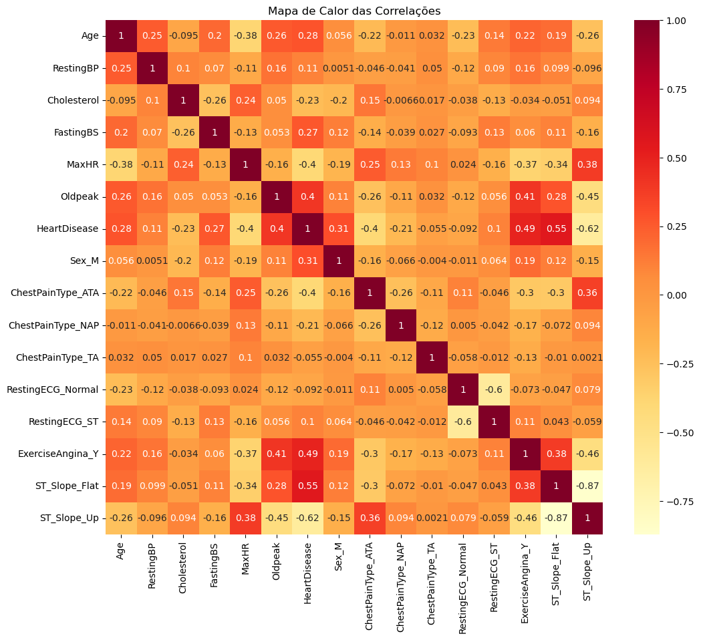
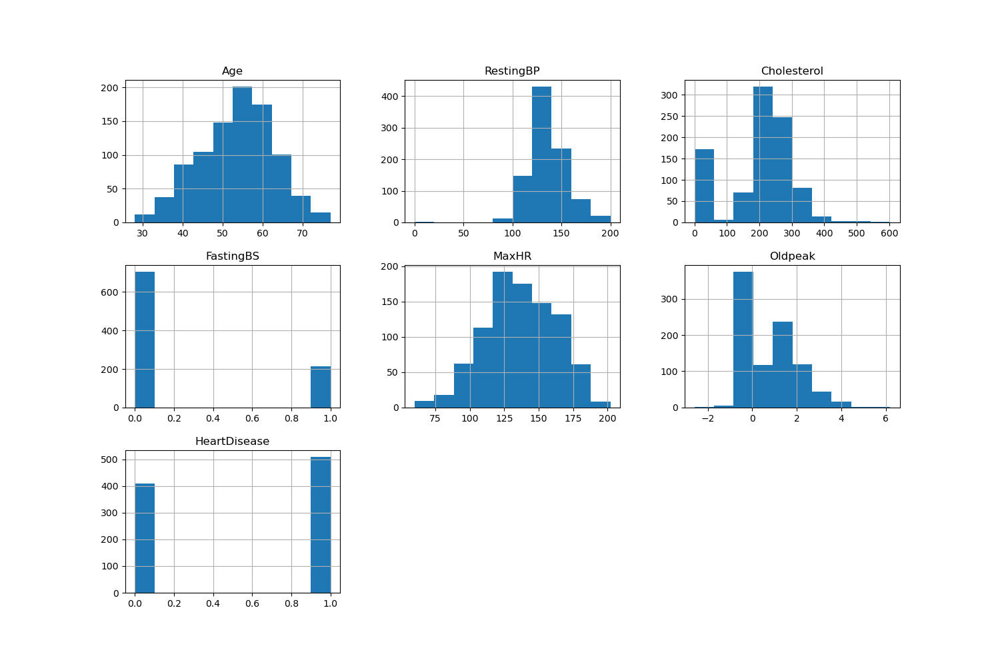

## **Relatório de Análise de Dados de Previsão de Insuficiência Cardíaca**

**Autor** : Wellington Moreira dos Santos - Cientista de Dados

**Contatos** : wsantos08@hotmail.com | [Linkedin](https://www.linkedin.com/in/wellington-moreira-santos/)

---

### **Introdução**

#### **Descrição do Problema**
As doenças cardiovasculares (DCVs) são uma das principais causas de morte em todo o mundo. Elas englobam diversas condições relacionadas ao coração e aos vasos sanguíneos, como infartos, hipertensão e insuficiência cardíaca. Identificar precocemente os fatores de risco associados às doenças cardíacas é crucial para implementar medidas preventivas e tratamentos eficazes.

#### **Objetivo da Análise**
O objetivo desta análise é explorar um conjunto de dados de pacientes com informações clínicas relacionadas à saúde cardíaca, identificar padrões e variáveis que possam estar associadas ao aumento do risco de doença cardíaca, e fornecer insights que possam ser utilizados em futuras predições e diagnósticos.

### **Exploração dos Dados**

#### **Estrutura dos Dados**
O dataset contém informações sobre 918 pacientes, com 12 colunas representando diversas características clínicas. A tabela a seguir resume a estrutura do dataset:

| Coluna           | Descrição                                     | Tipo de Dados |
|------------------|-----------------------------------------------|---------------|
| `Age`            | Idade do paciente                             | Numérico      |
| `Sex`            | Sexo do paciente (M: Masculino, F: Feminino)  | Categórico    |
| `ChestPainType`  | Tipo de dor no peito                           | Categórico    |
| `RestingBP`      | Pressão arterial em repouso (mm Hg)            | Numérico      |
| `Cholesterol`    | Nível de colesterol (mg/dl)                    | Numérico      |
| `FastingBS`      | Glicemia de jejum (> 120 mg/dl)                | Binário       |
| `RestingECG`     | Resultados do ECG em repouso                   | Categórico    |
| `MaxHR`          | Frequência cardíaca máxima                     | Numérico      |
| `ExerciseAngina` | Angina induzida por exercício (Y/N)            | Binário       |
| `Oldpeak`        | Depressão do segmento ST                       | Numérico      |
| `ST_Slope`       | Inclinação do segmento ST                      | Categórico    |
| `HeartDisease`   | Indicador de doença cardíaca (0: Não, 1: Sim)  | Binário       |

#### **Estatísticas Descritivas**
As estatísticas descritivas fornecem uma visão geral das variáveis numéricas no dataset:

- **Idade:** Média de 53,5 anos, com desvio padrão de 9,4 anos.
- **Pressão Arterial em Repouso:** Média de 132,4 mm Hg, com desvio padrão de 18,5 mm Hg.
- **Nível de Colesterol:** Média de 198,8 mg/dl, com desvio padrão de 109,4 mg/dl.
- **Frequência Cardíaca Máxima:** Média de 136,8 bpm, com desvio padrão de 25,5 bpm.
- **Depressão do Segmento ST (`Oldpeak`):** Média de 0,89, com desvio padrão de 1,07.

#### **Análise de Valores Ausentes**
O dataset não contém valores ausentes, o que facilita a análise e garante a integridade dos resultados.

#### **Distribuição das Variáveis**
- **Idade:** A maioria dos pacientes está na faixa etária de 47 a 60 anos, com poucos pacientes acima de 70 anos.
- **Sexo:** Há uma distribuição relativamente balanceada entre homens e mulheres, embora ligeiramente mais homens estejam presentes no conjunto de dados.
- **Tipo de Dor no Peito (`ChestPainType`):** A maioria dos pacientes relata dor do tipo angina atípica (ATA) ou dor assintomática (ASY).
- **Pressão Arterial e Colesterol:** Existem pacientes com valores extremos para essas variáveis, sugerindo possíveis outliers ou condições clínicas graves.
- **Frequência Cardíaca Máxima (`MaxHR`)**: A distribuição é assimétrica, com a maioria dos pacientes alcançando entre 120 e 160 bpm.

### **Análise de Correlação**

#### **Matriz de Correlação**
A correlação entre variáveis é uma medida estatística que descreve como uma variável se relaciona com outra. No contexto deste dataset, calculamos a matriz de correlação para entender quais variáveis têm maior influência sobre a presença de doença cardíaca (`HeartDisease`).

A matriz de correlação nos ajuda a identificar quais variáveis podem ser bons preditores para a doença cardíaca. Valores de correlação mais próximos de 1 ou -1 indicam uma forte relação linear entre as variáveis.

#### **Gráficos de Correlação**
Além da matriz numérica, os gráficos de correlação (como mapas de calor) são ferramentas úteis para visualizar essas relações. Eles facilitam a identificação rápida de padrões de correlação fortes ou fracos entre as variáveis.

### **Tratamento dos Dados**

#### **Processamento de Valores Ausentes**
Durante a análise dos dados, foi identificado que a coluna de colesterol (`Cholesterol`) continha 171 registros com valores de 0, o que não é plausível clinicamente. Esses valores foram substituídos pela média do colesterol após a remoção dos valores zeros. Esse procedimento garantiu que as análises subsequentes não fossem distorcidas por dados incorretos.

Além disso, foi identificado um registro com valor 0 na coluna de pressão arterial em repouso (`RestingBP`). Esse registro foi removido do dataset, pois um valor de 0 para pressão arterial não é fisiologicamente possível e poderia distorcer as análises.

#### **Transformações Realizadas**
Para possibilitar a análise de correlação e facilitar a construção de modelos preditivos, as variáveis categóricas foram convertidas em variáveis dummy, que são representações binárias (0 ou 1) de cada categoria.

### **Conclusão**

#### **Resumo das Principais Descobertas**
- A variável `Oldpeak` (depressão do segmento ST) mostrou a maior correlação positiva com a presença de doença cardíaca, sugerindo que maiores valores dessa variável estão associados a um maior risco de doenças cardíacas.
- A frequência cardíaca máxima (`MaxHR`) apresentou uma correlação negativa significativa, indicando que pacientes com menor capacidade de alcançar altas frequências cardíacas podem estar em maior risco.
- A idade e a glicemia de jejum (`FastingBS`) também se mostraram correlacionadas com a presença de doenças cardíacas, confirmando que a idade avançada e a glicemia elevada são fatores de risco importantes.
- A distribuição das variáveis, visualizada através dos histogramas, revelou padrões típicos esperados em populações de pacientes cardíacos, como a maior prevalência de condições em pacientes mais velhos e a variação na pressão arterial e colesterol.

#### **Visão Estatística dos Histogramas**

Os histogramas fornecem uma representação visual da distribuição dos dados em cada variável. Por exemplo:
- **Idade:** O histograma da idade mostra que a maioria dos pacientes tem entre 47 e 60 anos, refletindo a faixa etária mais comum para doenças cardíacas.
- **Pressão Arterial em Repouso (`RestingBP`)**: A maioria dos pacientes tem uma pressão arterial em repouso entre 120 e 140 mm Hg, o que é consistente com populações que apresentam risco cardiovascular.
- **Colesterol:** O histograma de colesterol, após o tratamento de valores zeros, mostra uma distribuição ampla, com alguns pacientes apresentando níveis muito altos, o que pode indicar hiperlipidemia.

