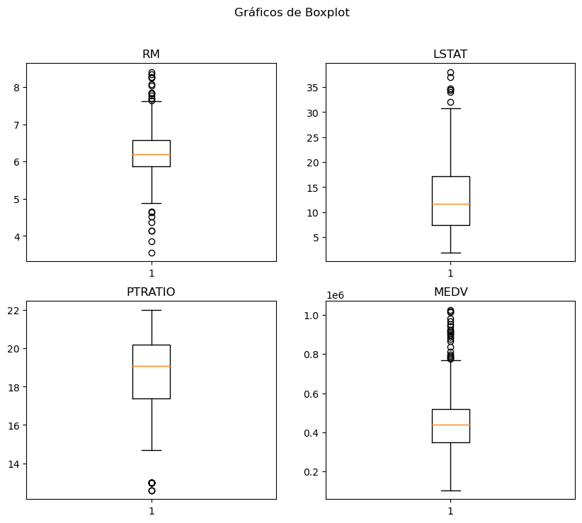
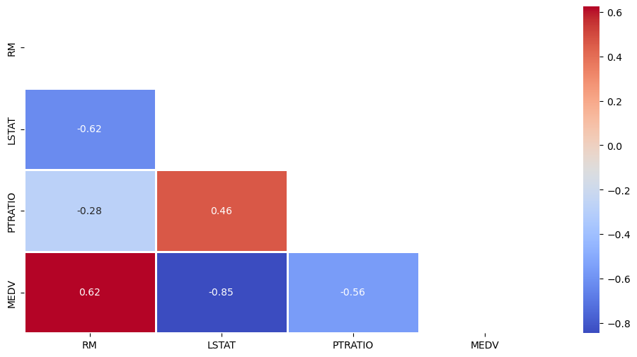

## **Relatório de Análise Exploratória de Dados - Preços de Imóveis**

**Autor**: Wellington Moreira - Cientista de Dados  
**Contatos**: wsantos08@hotmail.com | [Linkedin](https://www.linkedin.com/in/wellington-moreira-santos)

---

### **Introdução**

#### **Descrição do Problema**
O mercado imobiliário é influenciado por diversos fatores, como a qualidade da vizinhança, a taxa de criminalidade e a proximidade de escolas. Esse conjunto de dados contém informações sobre o preço de imóveis e diversas variáveis explicativas que podem ajudar a prever o valor das casas.

#### **Objetivo da Análise**
O objetivo da análise é explorar os dados para identificar padrões e correlações entre as variáveis que influenciam o preço dos imóveis, além de realizar uma análise estatística descritiva e visualizações para melhor compreensão dos dados.

---

### **Exploração dos Dados**

#### **Estrutura do Dataset**
O dataset contém 489 registros e 4 variáveis numéricas:

| Coluna    | Descrição                                                                 | Tipo de Dados |
|-----------|---------------------------------------------------------------------------|---------------|
| `RM`      | Número médio de cômodos por casa na região                                | Numérico      |
| `LSTAT`   | Percentual de proprietários no bairro considerados de "classe baixa"      | Numérico      |
| `PTRATIO` | Proporção de estudantes por professor nas escolas da região               | Numérico      |
| `MEDV`    | Valor médio das casas na região (em dólares)                              | Numérico      |

#### **Resumo Estatístico**
A seguir, o resumo estatístico das variáveis do dataset:

| Atributo   | Média    | Desvio Padrão | Mínimo  | 25%     | Mediana | 75%     | Máximo   |
|------------|----------|---------------|---------|---------|---------|---------|----------|
| `RM`       | 6.24     | 0.64          | 3.56    | 5.88    | 6.19    | 6.57    | 8.40     |
| `LSTAT`    | 12.94    | 7.08          | 1.98    | 7.37    | 11.69   | 17.12   | 37.97    |
| `PTRATIO`  | 18.52    | 2.11          | 12.60   | 17.40   | 19.10   | 20.20   | 22.00    |
| `MEDV`     | 454,343  | 165,340       | 105,000 | 350,700 | 438,900 | 518,700 | 1,024,800|

---

### **Análise de Outliers**
Outliers são valores extremos que podem influenciar os modelos de aprendizado. A análise de outliers nas variáveis revela os seguintes números de registros considerados extremos:

- **RM (Número de Cômodos)**: 22 outliers
- **LSTAT (Percentual de Classe Baixa)**: 7 outliers
- **PTRATIO (Proporção Estudantes/Professores)**: 13 outliers
- **MEDV (Valor Médio das Casas)**: 22 outliers

As visualizações de **boxplots** abaixo mostram graficamente a presença desses outliers.

---

### **Distribuição das Variáveis**
As distribuições das variáveis foram avaliadas através de histogramas e gráficos de probabilidade normal. Além disso, o **teste de normalidade de Shapiro-Wilk** foi aplicado para verificar se os dados seguem uma distribuição normal.

#### **Resultados do Teste de Normalidade**
- **RM (Número de Cômodos)**: p-valor = 2.7e-08 (distribuição não normal)
- **LSTAT (Percentual de Classe Baixa)**: p-valor = 1.7e-13 (distribuição não normal)
- **PTRATIO (Proporção Estudantes/Professores)**: p-valor = 9.1e-17 (distribuição não normal)
- **MEDV (Valor Médio das Casas)**: p-valor = 2.6e-10 (distribuição não normal)

Concluímos que nenhuma das variáveis segue uma distribuição normal, o que pode influenciar as escolhas de modelos e métricas estatísticas durante análises mais avançadas.

---

### **Correlação entre Variáveis**

A análise de correlação foi realizada utilizando o **coeficiente de Spearman**, pois os dados não seguem uma distribuição normal. O coeficiente de correlação de Spearman avalia a relação monotônica entre duas variáveis.

| Atributo    | Coeficiente de Correlação com `MEDV` | p-valor           |
|-------------|--------------------------------------|-------------------|
| `RM`        | 0.624                                | 3.84e-54 (Significativo) |
| `LSTAT`     | -0.846                               | 8.25e-135 (Significativo)|
| `PTRATIO`   | -0.559                               | 1.38e-41 (Significativo) |

#### **Interpretação das Correlações**
- **RM (Número de Cômodos)**: Correlação positiva com o valor médio das casas, ou seja, quanto maior o número de cômodos, maior o valor do imóvel.
- **LSTAT (Percentual de Classe Baixa)**: Correlação negativa forte com o valor médio das casas. Isso indica que bairros com maior proporção de população de classe baixa tendem a ter imóveis mais baratos.
- **PTRATIO (Proporção Estudantes/Professores)**: Correlação negativa moderada, sugerindo que regiões com alta proporção de estudantes por professor tendem a ter imóveis de menor valor.

#### **Mapa de Calor de Correlação**
A visualização das correlações foi feita através de um mapa de calor, destacando as relações mais fortes entre as variáveis.

---

### **Conclusão e Próximos Passos**

#### **Resumo das Principais Descobertas**
- A variável `LSTAT` (percentual de classe baixa) apresentou a maior correlação negativa com o valor dos imóveis, indicando que a composição socioeconômica do bairro é um fator determinante no preço das propriedades.
- O número de cômodos (`RM`) tem uma correlação positiva significativa, mostrando que casas com mais cômodos tendem a ser mais caras.
- A proporção de estudantes por professor (`PTRATIO`) tem uma correlação negativa moderada, sugerindo que regiões com menos recursos educacionais têm imóveis de menor valor.

Se precisar de mais informações ou tiver perguntas, fique à vontade para entrar em contato!