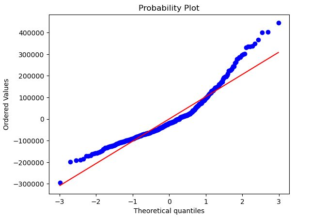
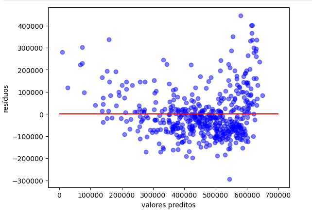
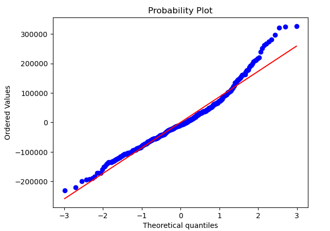
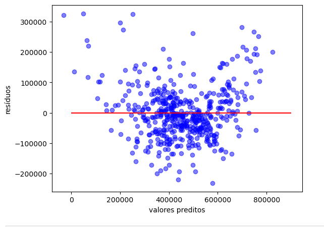

## **Relatório de Avaliação do Modelo de Regressão Linear - Preços de Imóveis**

**Autor**: Wellington Moreira - Cientista de Dados  
**Contatos**: wsantos08@hotmail.com | [Linkedin](https://www.linkedin.com/in/wellington-moreira-santos/)

---

### **Introdução**

#### **Descrição do Problema**
O mercado imobiliário é fortemente influenciado por diversos fatores socioeconômicos e geográficos. Este projeto visa desenvolver um modelo de **Regressão Linear** para prever o valor médio dos imóveis (`MEDV`) com base em variáveis explicativas como a quantidade média de cômodos por casa (`RM`), a proporção de população de baixa renda na área (`LSTAT`), e a proporção de alunos por professor (`PTRATIO`).

#### **Objetivo**
O objetivo desta análise é avaliar dois modelos de **Regressão Linear** — simples e múltipla — e verificar sua adequação para prever o valor dos imóveis, utilizando métricas estatísticas e a análise de resíduos para validar os modelos.

---

### **Análise do Modelo de Regressão Simples**

#### **Variáveis Utilizadas**
- **Variável dependente (target)**: `MEDV` (valor médio das casas)
- **Variável independente (predictor)**: `LSTAT` (percentual de população de baixa renda)

#### **Modelo de Regressão**
O primeiro modelo ajustado foi uma regressão simples entre `MEDV` e `LSTAT`, a variável explicativa que apresentou as melhores métricas de correlação na análise exploratória.

#### **Resultados do Modelo**
O modelo apresentou um **R² ajustado de 0.578**, indicando que 57.8% da variabilidade do valor dos imóveis pode ser explicada pela variável `LSTAT`. O coeficiente da regressão foi de -17,760, o que indica que, para cada aumento de 1% na população de baixa renda, o valor do imóvel tende a cair em 17,760 dólares, mantendo todas as outras variáveis constantes.

| Métrica                      | Valor        |
|------------------------------|--------------|
| **R² ajustado**               | 0.578        |
| **Coeficiente de `LSTAT`**    | -17,760      |
| **Intercepto**                | 684,100      |
| **p-valor do coeficiente**    | 0.000        |
| **p-valor da estatística F**  | 1.93e-93     |

#### **Análise dos Resíduos**
Os resíduos foram avaliados para verificar se o modelo atende às premissas de normalidade e homocedasticidade.

- **Teste de Normalidade (Shapiro-Wilk)**: p-valor = 9.78e-16. Os resíduos não seguem uma distribuição normal.
- **Teste de Homocedasticidade (Breusch-Pagan)**: p-valor = 0.0203. Não existe homocedasticidade, ou seja, os resíduos apresentam variância não constante.

Abaixo está o **gráfico de probabilidade normal** dos resíduos e o **gráfico de dispersão** dos resíduos em função dos valores preditos.

---

### **Análise do Modelo de Regressão Múltipla**

#### **Variáveis Utilizadas**
- **Variável dependente (target)**: `MEDV` (valor médio das casas)
- **Variáveis independentes (predictors)**: 
  - `RM` (número médio de cômodos por casa)
  - `LSTAT` (percentual de população de baixa renda)
  - `PTRATIO` (proporção de alunos por professor)

#### **Resultados do Modelo**
O modelo de regressão múltipla ajustado apresentou um **R² ajustado de 0.716**, indicando que 71.6% da variabilidade do valor das casas pode ser explicada pelas três variáveis selecionadas.

| Métrica                      | Valor        |
|------------------------------|--------------|
| **R² ajustado**               | 0.716        |
| **Coeficiente de `RM`**       | 86,570       |
| **Coeficiente de `LSTAT`**    | -10,850      |
| **Coeficiente de `PTRATIO`**  | -19,490      |
| **Intercepto**                | 415,500      |
| **p-valor dos coeficientes**  | < 0.001      |
| **p-valor da estatística F**  | 9.96e-133    |

#### **Interpretação**
- **RM**: Para cada aumento de uma unidade no número médio de cômodos, o valor da casa aumenta em 86,570 dólares.
- **LSTAT**: Cada aumento de 1% na população de baixa renda reduz o valor do imóvel em 10,850 dólares.
- **PTRATIO**: Cada aumento na proporção de estudantes por professor diminui o valor do imóvel em 19,490 dólares.

#### **Análise dos Resíduos**
- **Teste de Normalidade (Shapiro-Wilk)**: p-valor = 1.08e-09. Os resíduos não seguem uma distribuição normal.
- **Teste de Homocedasticidade (Breusch-Pagan)**: p-valor = 0.0060. Não existe homocedasticidade.

Os resíduos também foram avaliados graficamente para verificar desvios nas suposições do modelo.

#### **Multicolinearidade**
Não foram detectados problemas de **multicolinearidade** entre as variáveis independentes, uma vez que os coeficientes de correlação entre elas ficaram abaixo de 0.9.

---

### **Conclusão**

#### **Resumo dos Principais Resultados**
- O **modelo de regressão múltipla** apresentou um **R² ajustado** de 0.716, mostrando um bom poder explicativo ao considerar as variáveis `RM`, `LSTAT`, e `PTRATIO`.
- O modelo de regressão simples com `LSTAT` apresentou um **R² ajustado de 0.578**, sugerindo que a inclusão de variáveis adicionais melhora a explicação do modelo.
- Ambos os modelos não atenderam às suposições de **normalidade** dos resíduos e **homocedasticidade**, sugerindo que melhorias podem ser feitas no ajuste do modelo.

---

Se precisar de mais informações ou tiver perguntas, fique à vontade para entrar em contato!